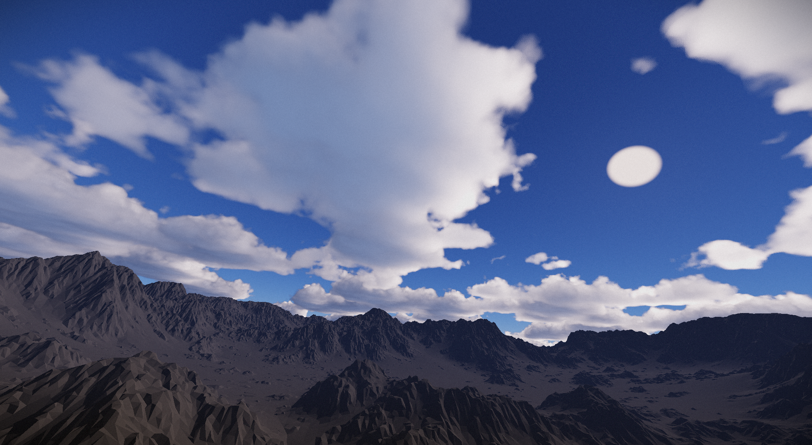
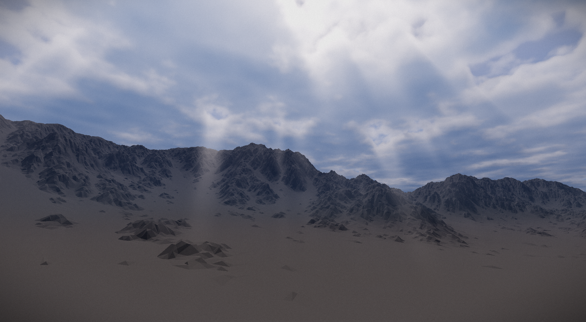
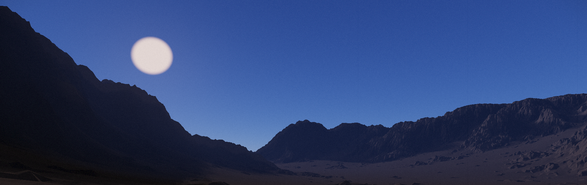
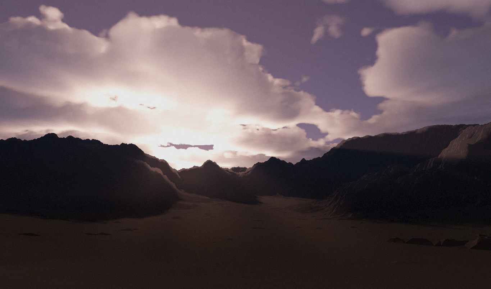
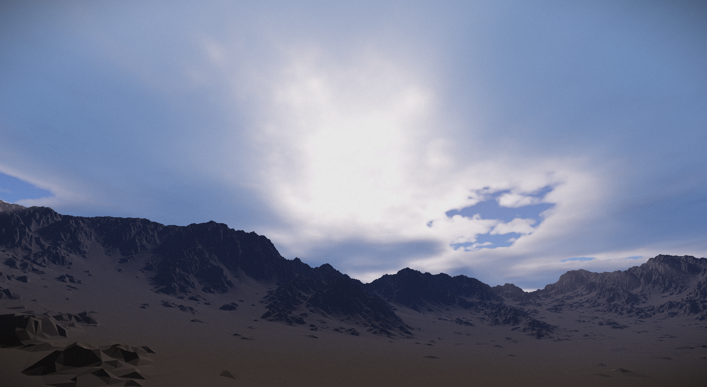

---
tags:
  - vulkan
  - c++
weight: 1
categories:
  - projects
  - posts
author: Matej Elias
draft: false
title: "Realistic atmosphere rendering"
ShowToc: true
TocOpen: true
hidemeta: false
comments: true
description: 'Physically-based atmosphere render with multiple scattering, aerial perspective, volumetric clouds and god rays'
disableHLJS: false
disableShare: false
hideSummary: false
searchHidden: false
#ShowReadingTime: true
ShowBreadCrumbs: true
ShowPostNavLinks: true
ShowWordCount: true
ShowRssButtonInSectionTermList: true
UseHugoToc: false
cover:
  image: hero.png
  alt: Obtained results
  relative: false
editPost:
    URL: "https://github.com/elliahu/atmosphere"
    Text: "Source code" # edit text
---
## About this project
This is an implementation of a complete atmospheric model and renderer with support of multiple scattering approximation that gives the sky its specific sky-blue color, sun transmittance, aerial-perspective, soft shadows, dynamic time of day, dynamic volumetric clouds with variable sizes, types and coverage and screen space god rays approximation. All that and more **running under 1.5 ms** on RTX 4080. This code is a part of my masters thesis called 'Realistic atmosphere rendering'.

[Source code](https://github.com/elliahu/atmosphere) can be found on my github.

## Performance

|                         | RTX 2060 | RTX 3060 | **RTX 4080** |
|-------------------------|----------|----------|-------------|
| Clouds               | 3.421 ms | 3.008 ms | **0.755 ms** |
| Transmittance LUT         | 0.141 ms | 0.127 ms | **0.034 ms** |
| Multiple scattering LUT  | 0.414 ms | 0.371 ms | **0.259 ms** |
| Sky View LUT              | 0.026 ms | 0.024 ms | **0.010 ms** |
| Aerial perspective LUT   | 0.095 ms | 0.097 ms | **0.080 ms** |
| Occlusion mask         | 0.631 ms | 0.615 ms | **0.161 ms** |
| Radial blur         | 0.154 ms | 0.150 ms | **0.040 ms** |
| Sky View LUT up-sample | 0.081 ms | 0.076 ms | **0.020 ms** |
| Composition               | 0.174 ms | 0.128 ms | **0.032 ms** |
| Postprocessing          | 0.069 ms | 0.069 ms | **0.017 ms** |
| **Total frame (with terrain)**       | 6.438 ms | 5.758 ms | **1.773 ms** |

## Gallery

## References
- [The Real-time Volumetric Cloudscapes of Horizon Zero Dawn](https://advances.realtimerendering.com/s2015/The%20Real-time%20Volumetric%20Cloudscapes%20of%20Horizon%20-%20Zero%20Dawn%20-%20ARTR.pdf)
- [Physically Based Sky, Atmosphere and Cloud Rendering in Frostbite](https://media.contentapi.ea.com/content/dam/eacom/frostbite/files/s2016-pbs-frostbite-sky-clouds-new.pdf)
- [Nubis: Authoring Real-Time Volumetric Cloudscapes with the Decima Engine](https://drive.google.com/file/d/0B-D275g6LH7LOE1RcVFERGpkS28/view?resourcekey=0-P04mYcVQ1lDPdn7FDunEIw)
- [A Scalable and Production Ready Sky and Atmosphere Rendering Technique](https://sebh.github.io/publications/egsr2020.pdf)
- [Volumetric Light Scattering as a Post-Process](https://developer.nvidia.com/gpugems/gpugems3/part-ii-light-and-shadows/chapter-13-volumetric-light-scattering-post-process)
