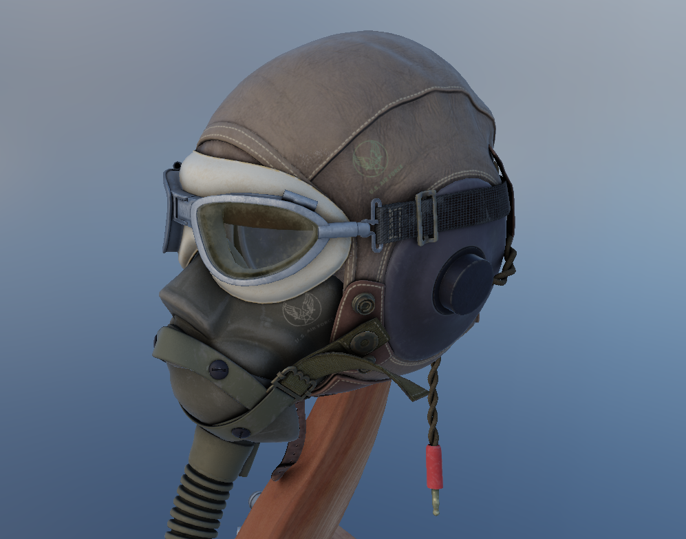
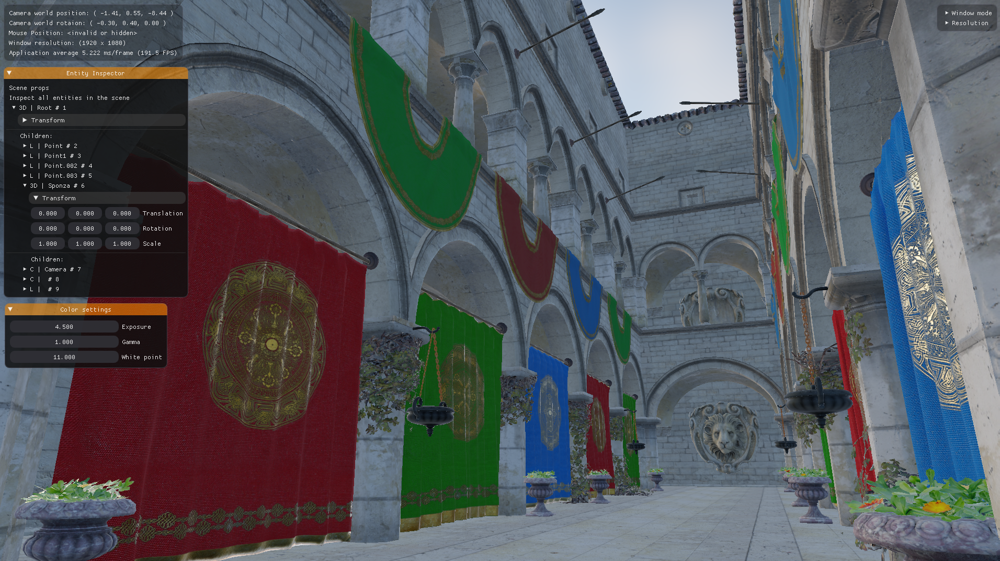
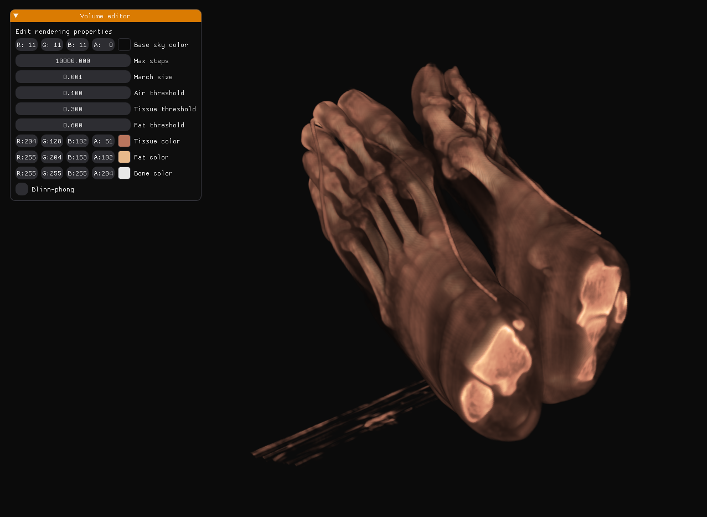

Custom real-time physically-based graphics engine using c++23 and Vulkan - the next generation graphics API.

## About this project
I've always enjoyed playing video games, but not quite like everyone else. While most people are immersed in the gameplay, I’ve always been curious about what’s happening under the hood. How do these games keep looking better and better? How is it even possible to render such detailed worlds on everyday hardware? These questions have fascinated me for as long as I can remember.

Once, while playing Horizon Forbidden West on the PS5, I spent over an hour just staring at a patch of moss—completely captivated by how realistic it looked. That’s who I am: someone who’s endlessly intrigued by the technology powering the visuals.

My first real hands-on experience with computer graphics was during university. While the professor wasn’t exactly the most approachable person, I thoroughly enjoyed the lectures. What I love most about computer graphics is how theory and practice come together to create something tangible—something you can see and interact with.

I started my graphics programming journey with OpenGL, learning the basics and building a strong foundation. At some point, for no particular reason other than that it sounded cool, I decided to dive into Vulkan. Many years (and countless challenges) later, here I am, working on a Vulkan-based graphics engine. It’s been a long road filled with sweat, tears, and plenty of late nights, but I’m proud of what I’ve accomplished so far.

The project is still a work in progress—there are parts of the code that need serious rewrites—but every day it gets better. And to me, that’s the exciting part: the process of creating, learning, and improving.

You can find the source code and more information in the [official repository](https://github.com/elliahu/HammockEngine).

## Screenshots
Here you can screenshots from some of my rendering endeavors using the Hammock.

